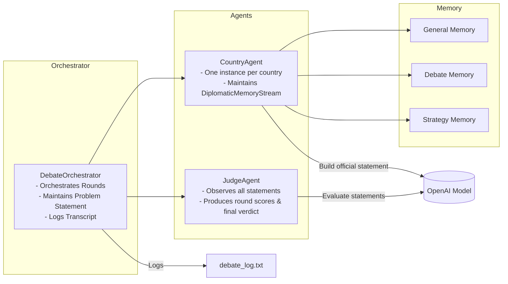
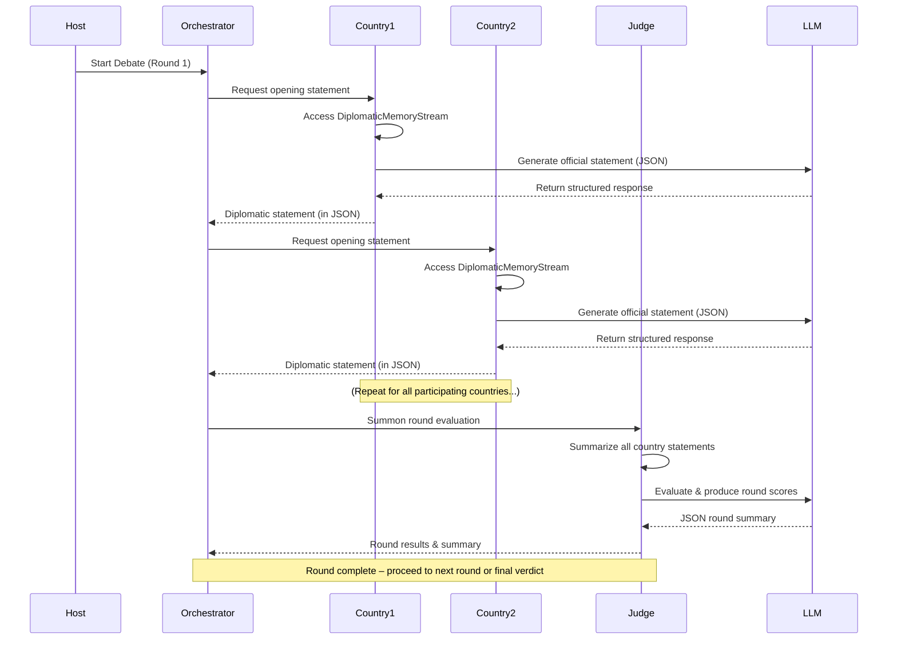

# Diplomatic Debate Simulation

A multi-agent, LLM-driven simulation for orchestrating diplomatic debates among different countries. Each `CountryAgent` responds with official statements, while a `JudgeAgent` evaluates each round and delivers a final verdict. The system is orchestrated end-to-end by a `DebateOrchestrator` that manages messaging and coordination among agents.

---

## Table of Contents

1. [Overview](#overview)
2. [Features](#features)
3. [Project Structure](#project-structure)
4. [Installation & Setup](#installation--setup)
5. [Usage](#usage)
6. [Detailed Example Flow](#detailed-example-flow)
7. [Design Rationale](#design-rationale)
8. [Time Complexity](#time-complexity)
9. [Key Modules & Classes](#key-modules--classes)
10. [Troubleshooting & FAQs](#troubleshooting--faqs)
11. [Contributing](#contributing)
12. [License](#license)
13. [Architecture & Flow](#architecture--flow)

---

## 1. Overview

The **Diplomatic Debate Simulation** provides an end-to-end solution for simulating a multi-round, multi-country debate over a specified geopolitical issue. Each country:

- Has a **profile** describing its background, foreign policy, etc.
- Implements a **CountryAgent** that uses a Large Language Model (LLM) to generate official statements.
- Maintains short-term and long-term **memory** of the conversation, strategic considerations, and overall historical context.

A **JudgeAgent** observes these statements every round, compiles them, scores each country, and eventually produces a **final verdict**. The entire conversation is orchestrated via `DebateOrchestrator`, which also logs every message to a transcript for later review.

**Key Purposes**:

- Demonstrate how separate AI agents can coordinate in a shared environment.
- Show how to parse LLM outputs to keep data structured, consistent, and robust.
- Provide an example of an interactive scenario where memory and profiles significantly affect agent responses.

---

## 2. Features

1. **Modular Agent Design**

   - **CountryAgent**: Focuses on generating official statements, validated by a diplomatic protocol check.
   - **JudgeAgent**: Evaluates each round, sets scores, and summarizes.

2. **Multi-Round Debate**

   - N configurable rounds; each country speaks in turn, the judge scores them, then final verdict.

3. **Strict JSON Parsing**

   - Output from each agent is forced into JSON with a parser.
   - This ensures structured data, easy introspection, and consistent updates.

4. **Profile Builder**

   - If a country’s profile doesn’t exist, we can build it automatically using search queries and LLM calls.
   - Fallbacks for incomplete data (backup prompts).

5. **Transcript Logging**

   - A textual `debate_log.txt` is produced, capturing all messages in a time-stamped format.

6. **Multi-Agent Coordination**
   - The orchestrator manages message broadcasting among participants, simplifying multi-agent communication.

---

## 3. Project Structure

```
.
├── run.py                 # Entry point script to initiate the debate
├── pyproject.toml         # Build system / project metadata
├── requirements.txt       # Python dependencies
├── data/
│   ├── country_profiles/
│   │   ├── united_states.json
│   │   ├── china.json
│   │   └── france.json
│   └── ...
├── src/
│   ├── agents/
│   │   ├── country_agent.py
│   │   ├── judge_agent.py
│   │   └── orchestrator.py
│   ├── builder/
│   │   └── builder.py
│   ├── memory/
│   │   └── streams.py
│   ├── models/
│   │   └── country_profile.py
│   ├── prompts/
│   │   └── ... # All the prompt templates for LLM
│   ├── parsers/
│   │   └── parsers.py
│   ├── utils/
│   │   └── utils.py
│   └── validator/
│       └── validator.py
└── ...
```

- **`run.py`**: Main entry point to run the entire simulation.
- **`src/agents/`**: Country, Judge, and Orchestrator logic.
- **`src/builder/`**: Tools for building or loading country profiles.
- **`src/memory/`**: Classes for memory management.
- **`src/models/`**: Data models (Pydantic) for typed profile structures.
- **`src/parsers/`**: JSON parsing logic to handle LLM responses.
- **`src/prompts/`**: Prompt templates specifying how the LLM should respond.
- **`src/validator/`**: Classes for validating (and applying changes to) profiles.

---

## 4. Installation & Setup

1. **Clone the repository**:

   ```bash
   git clone https://github.com/YourUserName/DebateSimulation.git
   cd DebateSimulation
   ```

2. **Create a virtual environment** (recommended):

   ```bash
   python3 -m venv venv
   source venv/bin/activate  # Mac/Linux
   # or for Windows:
   venv\Scripts\activate.bat
   ```

3. **Install dependencies**:

   ```bash
   pip install -r requirements.txt
   ```

4. **Set your environment variables**:

   - Typically, you need an `OPENAI_API_KEY` set for the LLM calls.
   - Optionally, create a `.env` file in the project root with:
     ```
     OPENAI_API_KEY=<your_key>
     ```

5. **(Optional) Build profiles**:
   - The first time you run it, any missing country profiles are built automatically. This might require internet access for DuckDuckGo search + LLM calls.

---

## 5. Usage

Once installed:

```bash
python run.py
```

By default, `run.py`:

- Initializes the model configuration.
- Defines a set of countries, e.g. `["United States", "China", "France"]`.
- Sets a problem statement: `"Disputed trade routes in international waters..."`.
- Runs `DebateOrchestrator(...)` for 3 rounds.
- Logs the entire conversation to `debate_log.txt`.

**Customizing**:

- **Number of Rounds**: In `run.py`, adjust `num_rounds=3` to your desired integer.
- **Countries**: Add or remove countries in the `countries = [...]` list. If no profile JSON exists, it builds it.
- **Log File**: Change `log_file_path` if you want a different name or location for the transcript.

---

## 6. Detailed Example Flow

1. **Initialization**:  
   The orchestrator imports country profiles, or if they don’t exist, runs the `CountryProfileBuilder` to build them.

2. **Round 1**:

   - The `Host` announces the problem statement.
   - Each `CountryAgent` speaks once, referencing its memory to produce a validated JSON response.
   - The `JudgeAgent` sees all these statements, calls the LLM to generate a round summary in JSON, and logs it.

3. **Round 2..N**:

   - The orchestrator repeatedly signals the next round.
   - Each country again produces a statement, referencing the newly updated debate memory.
   - The judge evaluates them again, storing the new round data.

4. **Final Verdict**:

   - When the orchestrator triggers the judge after the last round, the `JudgeAgent` compiles final scores, ranks each country, and produces a concluding summary.

5. **Logging**:
   - Each message is appended to `debate_log.txt` with a timestamp, role, and the message content.

---

## 7. Design Rationale

When I set out to build this **Multi-Agent Diplomatic Debate** simulation, I was fascinated by the idea of bringing multiple AI “voices” (each representing a different country) into a single environment and watching how they might interact. Here’s how I tackled it—and importantly, **why** I chose this path:

  1. I noticed that multi-agent LLM systems often lack clear structure: each agent might talk over one another, or produce unstructured responses. I wanted a system where every participant had a distinct perspective, spoke in JSON, and collaborated (or conflicted) in a controlled setting.  
   - **Why a Debate?** Because debates are naturally multi-turn, multi-perspective, and need strong coordination. It was a perfect playground to test how well these autonomous AI “characters” can negotiate, respond to each other, and remain consistent over multiple rounds.

2. **Breaking down the problems, piece by piece to declutter** 
   - **Memory Management**: Each country needs “remembrance” of previous statements—otherwise they’ll forget context. So I introduced a `DiplomaticMemoryStream` that tracks short-term (debate) and long-term (strategic) memory.  
   - **Structured Output**: LLMs can produce meandering text. I needed strict JSON for easy parsing (especially for the Judge’s scoring).  
   - **Orchestration**: How do we ensure each country speaks in turn, and the judge only intervenes at the right time? That’s where the `DebateOrchestrator` came in to control the conversation flow.  

   **Why** those decisions? Because from personal experience, AI outputs become unmanageable if you don’t parse them properly or store them in well-defined memory “slots.” I learned early that random text generation quickly gets out of sync if you can’t systematically parse or recall it.

3. **How the complex interactions were managed**  
   - **CountryAgent**: Focuses purely on generating a statement based on its internal memory—like a delegate reading from policy notes.  
   - **JudgeAgent**: Observes all statements, calls the LLM for a round summary, and eventually produces a verdict.  
   - **Why** separate them? I found that mixing the “speaker” role with the “evaluator” role just muddled the logic. Having a separate Judge keeps it fair and conceptually mirrors real-world debates: you have the participants and you have an umpire.

4. **Common issues and how they were tackled**  
   - **Parsing Errors**: The biggest headache was JSON output from the LLM sometimes included incomplete braces or strange punctuation. I wrote robust parsers and fallback steps (like sanitizing quotes).  
   - **Memory Overload**: As the rounds stacked, the agent prompts grew. So I decided to keep “recent memory” small and “longer memory” structured, so it’s only partially appended when needed.  
   - **Why** so many fallback strategies? Because AI is unpredictable, and I learned that ensuring each agent remains stable round after round requires plenty of guardrails.

5. **My underlying WHY**  
   - I wanted to show how different “characters” (countries) can not just speak but also track relationships and shift strategies over time.  
   - I’ve always been curious whether multi-agent dialogue can mimic real human negotiations. This project let me test that curiosity in a structured simulation.  
   - More broadly, I wanted a system that can scale or adapt: you can add new countries, or a separate role (like a press agent or a mediator), without rewriting all your code.

Ultimately, everything boiled down to making a simulation that feels robust, traceable, and *fun* to watch. The entire journey—from deciding on JSON structures to orchestrating a multi-round debate—was about ensuring consistency, clarity, and the possibility of easily adding new features if needed (like advanced memory retrieval, deeper judge analytics, or dynamic scoring). This is my personal “why”—building a flexible, multi-agent environment where each step is logically motivated by the desire for clarity, reusability, and a bit of real-world debate authenticity.

---

## 8. Time Complexity

- **Round Execution**: Each round calls `C` `CountryAgent`s, then 1 `JudgeAgent`. For `R` rounds, total calls = `O(R*C)`.
- **JSON Parsing**: Typically `O(M)` on the size of the LLM text, though overshadowed by network calls to the LLM.
- **Profile Building**: Each country profile is built once with multiple search queries + LLM calls. The overhead is mostly external API calls (I/O bound).

---

## 9. Key Modules & Classes

1. **`DebateOrchestrator`** (in `src/agents/orchestrator.py`)

   - Orchestrates the entire debate.
   - Methods:
     - `run_debate()`: Announces rounds, collects messages, triggers the judge, logs everything.

2. **`CountryAgent`** (in `src/agents/country_agent.py`)

   - Subclass of `DialogAgent`.
   - Maintains a `DiplomaticMemoryStream` for each country.
   - `reply(...)`: Build prompt from memory, call LLM, parse JSON, validate the statement.

3. **`JudgeAgent`** (in `src/agents/judge_agent.py`)

   - Evaluates each round by reading all relevant country statements.
   - `_evaluate_round(...)` ensures each country spoke once, calls the LLM to produce a JSON-based round summary.
   - `_final_verdict(...)` compiles a final ranking and summary.

4. **`DiplomaticMemoryStream`** (in `src/memory/streams.py`)

   - Manages general, debate, and strategy memories for a single country.
   - Adds new statements to the debate memory, triggers “strategic analysis” calls for foreign statements.

5. **`CountryProfileBuilder`** (in `src/builder/builder.py`)

   - Either loads a JSON file if the profile exists or builds it by using search queries + LLM calls.
   - Validates the final profile with `ProfileValidator`.

6. **Parsers** (in `src/parsers/parsers.py`)
   - A set of `MarkdownJsonDictParser` objects for different tasks, e.g. parsing round output, final verdict, or country statements.

---

## 10. Troubleshooting & FAQs

1. **The judge raises “Expected X but got 0”**

   - This usually means the judge didn’t receive the countries’ messages. Ensure that each agent’s name matches exactly the strings in `judge_agent._country_list`.

2. **JSON Parsing Errors (“invalid control character”)**

   - Sometimes LLMs produce curly quotes or incomplete JSON.
   - Add a sanitize step (e.g. replacing `“` with `"` before parse) or instruct the LLM to strictly use ASCII quotes.

3. **Profile Fails to Build**

   - Check your network connection or your API keys for DuckDuckGoSearchAPIWrapper. Also ensure your `OPENAI_API_KEY` is set.

4. **LLM Repeats the Same Statement**
   - Increase `temperature` in the model config or add more context changes from round to round. Ensure no caching is interfering.

---

## 11. Contributing

1. **Fork & Clone**: If you want to propose changes, fork the repo and clone locally.
2. **Create a Branch**: For a new feature or bugfix, `git checkout -b feature/your-feature`.
3. **Code Standards**:
   - Add docstrings where missing.
   - Ensure `pylint` or `flake8` passes if you have style checks.
4. **Pull Request**: Submit a PR describing the change or fix. We’ll review it ASAP.

---

## 12. License

This repository is distributed under the **MIT License**. See `LICENSE` for more details.

---

## Thank You!

We hope the Diplomatic Debate Simulation helps you explore advanced usage of multi-agent systems and structured LLM interactions. If you have any questions, feel free to open an issue or reach out!

_Enjoy simulating diplomatic negotiations!_

---

## 13. Architecture & Flow

This section visually explains how the system’s components interact and how a single debate round unfolds.

### 13.1 Architecture Diagram



**Explanation**:

1. **DebateOrchestrator** (O) controls the debate flow and logging.
2. **CountryAgent** (A1) uses a `DiplomaticMemoryStream` (M1, M2, M3) and calls the LLM to build official statements.
3. **JudgeAgent** (A2) evaluates statements each round using the LLM.
4. The final transcript is written to `debate_log.txt`.

### 13.2 Sequence Diagram (Round Flow)



**Explanation**:

1. The **Host** (system or user) triggers the round start.
2. The **Orchestrator** requests each **CountryAgent**’s statement sequentially.
3. Each **CountryAgent** calls the **LLM** to craft a JSON-based diplomatic response, referencing their memory.
4. After all countries speak, the **JudgeAgent** evaluates them, also using the **LLM**.
5. The result is compiled, and the Orchestrator either proceeds to the next round or obtains the final verdict if all rounds are complete.

---
