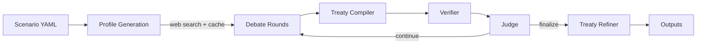

# Multi-Agent Diplomatic Debate (MADD)

**LangGraph pipeline that turns a scenario into a structured negotiation -> treaty -> audit trail.**

- **Negotiation engine** — round-based proposals, amendments, voting with coalition dynamics (WIP)
- **Treaty-grade outputs** — treaty + annexes + transcript + structured citations
- **Auditable by design** — claim verification, contradiction detection, enforceability checks
- **Pluggable** — separate model configs for research / debate / judge / verifier


---

## Why MADD?

LLM debate demos are easy; _auditable negotiation_ is hard.

MADD is a reference implementation for turning multi-agent dialogue into **(1) a structured agreement** and **(2) a verifiable trail**: what was proposed, why it was accepted, and which claims were supported by sources.

Use cases:

- **Benchmark harness** for multi-agent negotiation research
- **Policy/treaty drafting** workflow with compliance audit
- **LangGraph reference project** for complex agent orchestration

---

## Try it in 2 minutes

```bash
git clone https://github.com/KartikVashishta/MultiAgentDiplomaticDebate
cd MultiAgentDiplomaticDebate

python -m venv .venv && source .venv/bin/activate
pip install -e .

export OPENAI_API_KEY="sk-..."

madd examples/scenarios/greenland.yaml --rounds 3
```

---

## What you get

### transcript.md

```markdown
## Round 1 - Denmark

Denmark and the United States open talks with mutual respect for sovereignty
and shared security responsibilities in the Arctic. We welcome cooperative
steps to strengthen regional defense while ensuring Greenlandic self-determination...

We ask the U.S. to provide an initial written outline of intended defense
footprints within 45 days. As an offer, Denmark will consider streamlined
procedural approvals for projects meeting licensing and environmental benchmarks.

_Sources: [cite_01c8c2022e], [cite_cbde2a634a]_

**Proposed Clauses:**

- Clause 1 (Defense Access & Basing): Define 'temporary access' as deployments
  under 180 days per calendar year...
```

### treaty.md

```markdown
## Accepted Clauses

**C3** (proposed by Denmark)

> Environmental, Indigenous & Monitoring Safeguards: Mandatory ESIA/EIA
> consistent with international best practice; independent verification.
> No-go Zones: Protect areas designated by Greenlandic authorities.
> FPIC for projects affecting Inuit lands.
> Grievance Mechanism: Independent ombuds with binding orders.

**C16** (proposed by United States)

> Cyber, Technology Safeguards & Incident Reporting: Operators must report
> cybersecurity incidents within 24 hours. Annual independent security audits.
```

### sources.json

```json
[
  {
    "id": "cite_01c8c2022e",
    "title": "www.defense.gov",
    "url": "https://www.defense.gov/News/...",
    "topic": "history",
    "used_in": ["Round1-Denmark", "Round2-Denmark"]
  },
  {
    "id": "cite_cbde2a634a",
    "title": "www.nato.int",
    "url": "https://www.nato.int/...",
    "topic": "defense_posture"
  }
]
```

### audit.json

```json
[
  {
    "severity": "warning",
    "category": "unsupported_claim",
    "description": "United States made factual/legal statements without citations",
    "country": "United States",
    "round_number": 2,
    "evidence": ["Statement snippet: ...", "references_used: []"]
  }
]
```

Full outputs: [examples/output/greenland_demo/](examples/output/greenland_demo/)

---

## Architecture



| Step                | What happens                                            | Code                                                            |
| ------------------- | ------------------------------------------------------- | --------------------------------------------------------------- |
| **Scenario**        | Load countries, agenda, constraints                     | [`core/scenario.py`](src/madd/core/scenario.py)                 |
| **Profile Gen**     | Web search per country, cache with citations            | [`agents/researcher.py`](src/madd/agents/researcher.py)         |
| **Debate**          | Each country proposes clauses, votes, issues statements | [`agents/country.py`](src/madd/agents/country.py)               |
| **Treaty Compiler** | Resolve votes (majority), track amendments              | [`core/graph.py`](src/madd/core/graph.py)                       |
| **Verifier**        | Check unsupported claims, contradictions                | [`agents/verifier.py`](src/madd/agents/verifier.py)             |
| **Judge**           | Score diplomatic effectiveness per round                | [`agents/judge.py`](src/madd/agents/judge.py)                   |
| **Refiner**         | Compile accepted clauses into treaty + annexes          | [`agents/treaty_refiner.py`](src/madd/agents/treaty_refiner.py) |

**Web search**: Uses OpenAI's `web_search` tool via the Responses API. Results are cached per-scenario to avoid redundant calls. Pluggable via `src/madd/tools/web_search.py`.

---

## Configuration

### Environment variables

```bash
OPENAI_API_KEY="sk-..."           # Required

# Model overrides (default: gpt-5-mini)
MADD_TURN_MODEL="gpt-5-mini"      # Country agent turns
MADD_JUDGE_MODEL="gpt-5-mini"     # Scoring
MADD_VERIFY_MODEL="gpt-5-mini"    # Claim verification
MADD_RESEARCH_MODEL="gpt-5-mini"  # Profile research

# Behavior
MADD_SEARCH_CACHE="true"          # Cache web search results
MADD_STRICT_VOTES="false"         # Error on missing votes
```

### Scenario YAML

```yaml
name: 'Greenland Security and Critical Minerals'
description: |-
  With Greenland's strategic location and critical-minerals potential...

countries:
  - Denmark
  - United States

max_rounds: 3

agenda:
  - topic: 'Defense access and updated basing arrangements'
    description: 'Clarifying U.S./NATO presence, reviewing the 1951 defense framework'
    priority: 1

  - topic: 'Critical minerals investment and supply-chain guarantees'
    description: 'Rules for licensing, financing, local value creation'
    priority: 2

  - topic: 'Environmental, Indigenous, and community safeguards'
    description: 'Shared environmental-impact standards, consultation mechanisms'
    priority: 3
```

### CLI

```bash
madd <scenario.yaml>              # Run with defaults
madd <scenario.yaml> --rounds 5   # Override max rounds
madd <scenario.yaml> --output-dir ./my_output
madd <scenario.yaml> --watch      # Show per-node progress updates while running
madd <scenario.yaml> --print-summary  # Print final summary.md after completion
madd-ui                          # Launch the web scenario studio at http://127.0.0.1:8000
```

### Scenario Studio

Run a new case directly from the browser:

```bash
madd-ui --host 127.0.0.1 --port 8000
```

---

## Evaluation

Basic metrics tracked per run:

| Metric                  | Description                                       |
| ----------------------- | ------------------------------------------------- |
| **Unsupported claims**  | Statements without citation references            |
| **Treaty completeness** | Accepted clauses with enforcement + timelines     |
| **Negotiation outcome** | Accepted/rejected/pending clauses per agenda item |
| **Score trajectory**    | Per-country diplomatic effectiveness over rounds  |

See `scorecards.json` and `audit.json` in output.

---

## Project structure

```
├── src/madd/
│   ├── agents/        # Country, Judge, Verifier, Researcher, Treaty Refiner
│   ├── core/          # Schemas, config, state, graph, scenario router
│   ├── stores/        # Profile cache and run output persistence
│   └── tools/         # Web search with caching
├── examples/
│   ├── scenarios/     # YAML scenario definitions
│   └── output/        # Committed demo outputs
├── tests/             # Pytest tests
└── assets/            # Demo visuals
```

---

## Roadmap

- [ ] Streaming + live viewer
- [ ] 3+ countries + coalition dynamics
- [ ] Scenario library + evaluation metrics
- [ ] Local models (vLLM / Ollama)
- [ ] Human-in-the-loop clause drafting
- [x] Web UI scenario builder (minimal scenario studio)

---

## Development

```bash
pip install -e ".[dev]"
pytest tests/ -v
ruff check src/
```

---

## License

MIT
